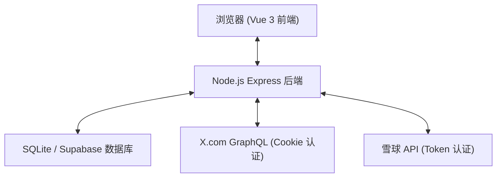

# 项目架构详解

## 技术栈概览

| 类别 | 技术 | 版本 | 核心作用 |
|------|------|------|----------|
| 前端框架 | Vue 3 | ^3.3.0 | 响应式 UI、Composition API 逻辑复用 |
| 构建工具 | Vite | ^5.0.0 | 极速热更新、现代构建流水线 |
| 后端运行时 | Node.js | 18+ | 核心逻辑执行、X API Cookie 认证支持 |
| Web 服务 | Express | ^4.18.0 | 轻量级 RESTful API 服务 |
| 数据库 (开发) | better-sqlite3 | ^9.0.0 | 本地高性能推文持久化 |
| 数据库 (云端) | Supabase | ^2.39.0 | PostgreSQL 生产环境方案 |

## 系统架构图

## 核心组件解析

### 1. 前端层 (Vue 3)
- **`HomeView.vue`**: 核心视图，处理混合流分页加载、自动刷新与视觉反馈。
- **`TweetCard.vue`**: 通用卡片组件。根据 `source` 属性（`xueqiu` 或 `twitter`）动态调整样式与交互跳转。
- **`UserSettingsView.vue`**: 双栏管理界面。左侧雪球，右侧 Twitter，提供用户同步与删除操作。

### 2. 后端服务层 (Express)
- **Service 模式**: `xService.js` 与 `xueqiuService.js` 封装了原始 API 调用与错误重试逻辑。
- **同步器 (Sync)**: 使用 `setInterval` 在后台静默抓取数据，确保数据库数据始终保持最新。
- **认证插件**: 基于 JWT 对 `/user_settings` 和 `/queryid-config` 等敏感路由进行保护。

### 3. 数据存储层
- **推文表**: 存储经过清洗的推文数据，包含 `text`、`html` 处理后的内容、媒体链接等。
- **配置表 (Settings)**: 存储变化的 `X-CT0`、`auth_token`、`QueryId` 等关键凭证，支持热更新。

## 数据流向：推文抓取与过滤
1. **抓取**: 同步服务定期调用服务层。
2. **清洗**: 后端对推文进行 HTML 实体解码、URL 链接化处理。
3. **过滤**: 执行日语/韩语正则检测，过滤掉不符合语言偏好的内容。
4. **查重**: 基于推文 ID 检查数据库，防止重复存储。
5. **持久化**: 存入 SQLite 或 Supabase。
6. **分发**: 前端每 8 秒轮询 API，获取最新并标记为“未读”的推文。
